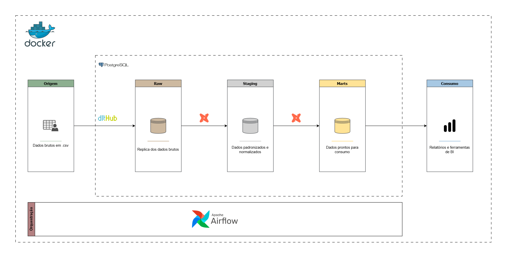
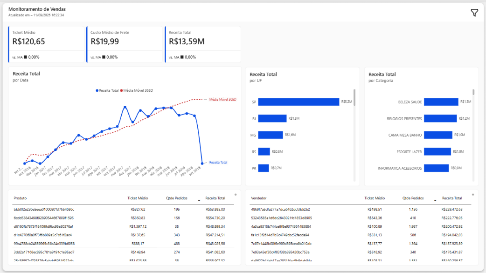

# Olist Data Platform

## 📜 Sumário
1. [📋 Sobre o Projeto](#-sobre-o-projeto)
2. [⚙️ Tecnologias Utilizadas](#️-tecnologias-utilizadas)
3. [🚀 Como Executar](#-como-executar)
4. [📊 Estrutura do Projeto](#-estrutura-do-projeto)
5. [🗒️ Licença](#️-licença)
6. [📞 Contato](#-contato)

## 📋 Sobre o Projeto

Plataforma de data warehouse para análise de dados de e-commerce. Implementa pipeline moderno de ETL com dbt e dlt, transformando dados brutos do dataset público Olist em insights acionáveis através de PostgreSQL.



## ⚙️ Tecnologias Utilizadas

- **PostgreSQL 16** - Data warehouse
- **dbt** - Transformação e modelagem de dados
- **dlt** - Ingestão de dados
- **Airflow** - Orquestração de pipelines
- **Python 3.12** - Linguagem principal
- **Docker Compose** - Containerização

## 🚀 Como Executar

### Pré-requisitos
- Docker instalado
- Python 3.12+
- uv (gerenciador de pacotes)

### Dashboard
[Acesse o dashboard](https://app.powerbi.com/view?r=eyJrIjoiNmFmYjU1N2YtODk5OC00MWY2LWEzOGQtYWRmN2VkNzhlODQwIiwidCI6IjA1ZjBkZDRhLTE2N2ItNGUxOC1iZTBmLTExNTAxYTg4YmFhYyJ9). 


### Instalação

1. **Clone o repositório**
```bash
git clone https://github.com/datalopes1/olist_analytics.git
cd olist_analytics
```

2. **Configure as variáveis de ambiente**

Edite `.env` com suas credenciais:
```
POSTGRES_USER=seu_usuario
POSTGRES_PASSWORD=sua_senha
POSTGRES_DB=olist_dwh
```
Crie a pasta ``.dlt`` e configure o ``secrets.toml``
```
[destination.postgres.credentials]
database = ""
username = ""
password = ""
host = "host.docker.internal"
port = 5433
drivername = "postgres"
```

3. **Inicie o PostgreSQL**
```bash
docker-compose up -d
```

4. **Instale dependências Python**
```bash
uv sync
```

5. **Inicie o Airflow com Astro**
```bash
astro dev start
```

## 📊 Estrutura do Projeto
```
olist_analytics/
├── .astro/
├── dags/                               
├── data/                         # Arquivos brutos     
├── dbt/                          # Transformações (star schema)
│   ├── macros/
│   └── models/
│       ├── staging/              # Camada intermediária
│       └── marts/                # Modelos de análise      
├── docker/                       # Configurações Docker             
├── img/                                 
├── pbi/                          # Dashboard em .pbip        
├── src/                          # Scripts Python (ingestão)
└── docker-compose.yml            # Infraestrutura
```
## 📄 Licença

Este projeto está licenciado sob a MIT License. Veja o arquivo [LICENSE](./LICENSE) para mais detalhes.

## 📧 Contato

**Autor:** André Lopes  
**Portfolio completo:** [datalopes1.github.io](https://datalopes1.github.io/)  
**Email:** datalopes1@gmail.com | datalopes1@proton.me